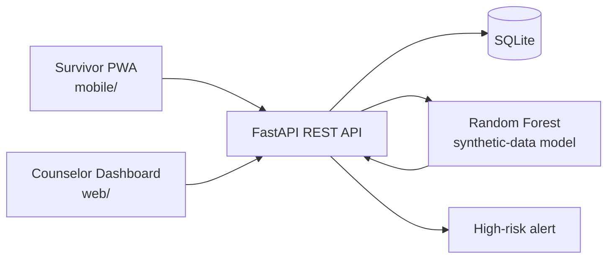

# SaathiCare — SIH26094 MVP

**Version:** 0.1.0 · **Status:** Demo baseline

SaathiCare is a demonstration prototype for **AI-Powered Dynamic Mental Health Monitoring and Distress Prediction System for Victims of Atrocities**. It offers a survivor-facing installable web app, a counselor dashboard, and a FastAPI/SQLite backend with an explainable Random Forest screening model.

> Safety: Every result is a **screening risk estimate, not a diagnosis**. The model was trained only on generated synthetic data; it must not be used to make clinical, legal, or emergency decisions.

## Architecture



## Run locally

Requires Python 3.11+.

```powershell
python -m venv .venv
.\.venv\Scripts\Activate.ps1
pip install -r requirements.txt
python -m backend.train_model
python -m uvicorn backend.main:app --reload
```

In separate terminals, serve the static clients (do not open their HTML files directly, because PWA/API browser restrictions may apply):

```powershell
python -m http.server 5173 --directory mobile
python -m http.server 5174 --directory web
```

Open `http://127.0.0.1:5173` for the survivor app and `http://127.0.0.1:5174` for the counselor portal. The API documentation is at `http://127.0.0.1:8000/docs`.

To use a different backend URL, set `localStorage.saathi_api` in either browser console, then reload.

### Android-compatible demo

Open the mobile URL in Chrome on Android and use **Install app** / **Add to Home Screen**. It is a responsive PWA with a standalone manifest and service worker; no Android SDK or Flutter installation is required for the demo.

## Demo flow

1. Register a survivor account in the mobile app, then complete a check-in with values near `5` to trigger a high-risk demonstration alert.
2. Sign in to the dashboard as `counselor@saathicare.demo` / `Demo@123`.
3. Open **Alerts** or **People**, inspect the person’s trend and journal entries, then add a counselor note.

Seed survivor: `asha@saathicare.demo` / `Demo@123`.

## DEMO CREDENTIALS — not for production

| Role | Username | Password | Jurisdiction | Intended Role Scope |
|---|---|---|---|---|
| **District Officer** | `district_officer` | `District@123` | Hathras | Scoped to Hathras District cases & alerts |
| **State Officer** | `state_officer` | `State@123` | Uttar Pradesh | Scoped to Uttar Pradesh State oversight |
| **Assigned Counsellor** | `counselor_ananya` | `Demo@123` | Hathras | Direct victim care & intervention review |
| **National Admin** | `national_admin` | `Admin@123` | National | Full national oversight & rules matrix admin |

Authentication endpoint `POST /api/auth/login` verifies credentials and issues a signed JWT access token (8-hour expiry) containing `user_id`, `role`, and `jurisdiction` claims.

## API summary

| Endpoint | Purpose |
|---|---|
| `POST /auth/register`, `POST /auth/login` | Account access |
| `GET /me` | Current profile |
| `PATCH /me` | Update survivor name / phone |
| `POST /checkins`, `GET /checkins/me` | Create/view survivor check-ins and risk estimates |
| `GET /dashboard`, `GET /users`, `GET /users/{id}` | Counselor views |
| `POST /users/{id}/notes` | Counselor follow-up note |
| `PATCH /alerts/{id}/resolve` | Resolve a high-risk alert |
| `GET /resources`, `POST /resources`, `DELETE /resources/{id}` | Survivor resource library / counselor management |

Send `Authorization: Bearer <token>` for protected routes. Interactive OpenAPI docs provide request schemas and live testing.

## Data model

`users` holds authenticated survivor/counselor accounts; `checkins` stores 1–5 questionnaire answers, optional journal entry, model result, and timestamp; `alerts` links high-risk checks to a review status; `notes` stores counselor follow-ups. SQLite is isolated in `data/app.db` so it can be replaced by PostgreSQL later.

## AI model

`backend/train_model.py` deterministically creates 1,800 synthetic questionnaire rows and trains a 160-tree Random Forest. Features: mood, anxiety, stress, sleep disruption, fear/safety, social isolation, and emotional wellbeing. `data/synthetic_dataset.md` documents the data. The model artifact is generated at startup if absent, and is deliberately ignored by Git.

## Production follow-up

Replace demo authentication with an audited identity provider; set a strong `APP_SECRET`; use HTTPS, encryption, consent/audit controls, access policy, clinical validation, locally verified emergency resources, and human review protocols before any real-world deployment.
